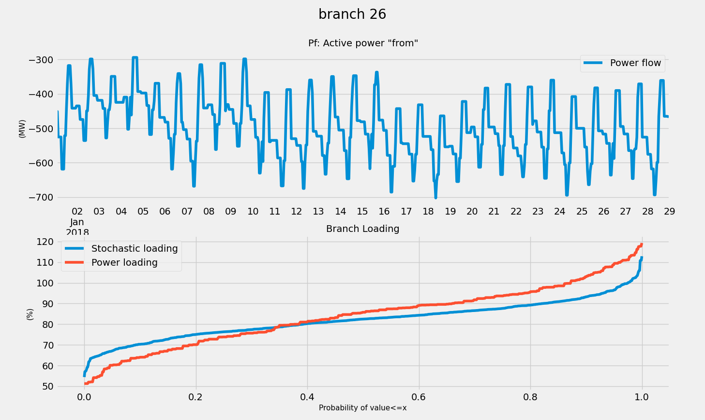

# 🎳 Clustering

In VeraGrid you can perform a clustering simulation.
This will create a ClusteringResults object that we can "recycle" 
to run other time series simulations.


For instance, if we have a yearly (8760h) profile,
and we run a 400h cluster, then when running a
time series power flow with clustering, you will only
simulate 400 time steps, and then the results will be expanded
to 8760 time stamps afterward using the clustering information.

The clustering activation button is next to the clustering 
run button in the simulations buttons ribbon or the simulations menu.

## API

The following is an example of how to use the clustering in
conjunction with a time series simulation programmatically.

```python
import VeraGridEngine as vg

# import some grid with time series
grid = vg.open_file("IEEE39_1W.veragrid")

# run a clustering analysis
cl_options = vg.ClusteringAnalysisOptions(n_points=200)
cl_drv = vg.ClusteringDriver(grid=grid, options=cl_options)
cl_drv.run()

# run a time series simulation, using the clustering information
pf_options =vg.PowerFlowOptions()
pf_ts_driver = vg.PowerFlowTimeSeriesDriver(
    grid=grid,
    options=pf_options,
    clustering_results=cl_drv.results
)

pf_ts_driver.run()

pf_res: vg.PowerFlowTimeSeriesResults = pf_ts_driver.results
```

Observe that by passing the `clustering_results` argument
to the driver, it will automatically run the time steps
given by the clustering and expand the results after the simulation.

Cool, right?


## Theory

Either in power systems markets, or centralized dispatch,
the "dispatcheable" generation reacts to the non-dispatcheable
injections (Load + non-manageable renewable generation)
Hence, we can assemble a matrix of profiles with T time steps and 
Load + non-dispatcheable generators as columns. This data
represents the behaviour of the grid, since any later dispatch would be
just a reaction to the a-priori data.

Running a simple k-means clustering over this matrix, we can
readily obtain the cluster centers. The cluster center are new
points that did not exist in the original data matrix. 
It would be mathematically correct, to simulate the cluster centers
and report back those results. However, less technified users would freak out.

So, in order for people not to lose their marbles, we adapt the cluster
centers to the closest original data point. In this fashion we can
find which indices of the original time series, represent better the
mathematical cluster centers. From that, we compute the probability
of each original time step for later expansion of simulated results with the
adapted cluster centers.  

This has proven to work well enough in practice, yielding similar 
cumulative density functions as the probabilistic power flow 
(in the case of power flow with clustering)

