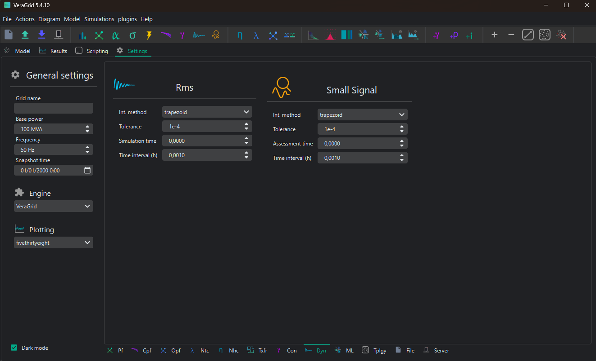
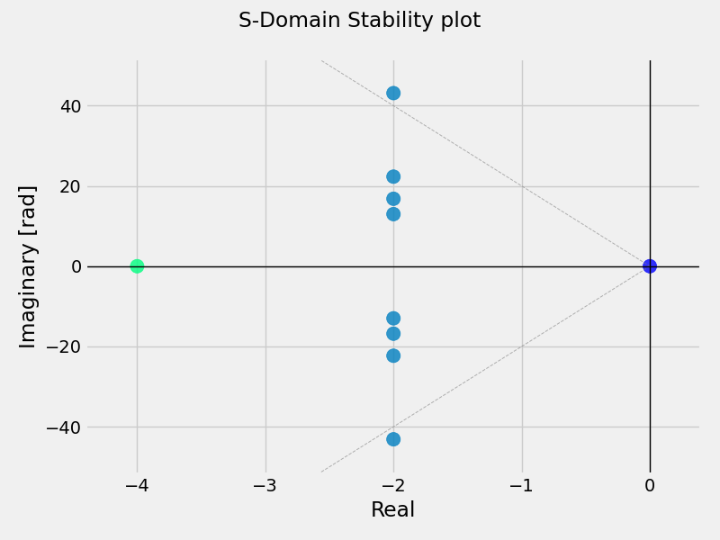
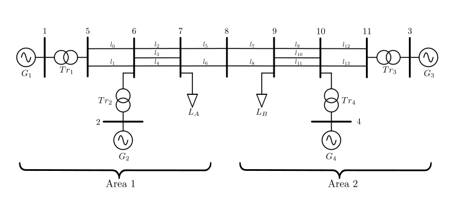

# 🔍 Small-Signal stability analysis

Stability assessment is crucial for any system and of course, VeraGrid has it.

⚠️ Before performing small-signal stability analysis, a power flow calculation must be completed! 
### Settings
This is the Small-Signal settings page:



 The main setting in Small-Signal Stability assessment is the time instant when the analysis is performed. 
 Therefore, if the assessment time is zero, no dynamic simulation is needed and the only parameter to set is the
 assessment time itself. Otherwise, Rms dynamic simulation parameters are considered.

Below, a list of the parameters and integration methods available.

Settings:

- **Integration method**: The integration method to use if the Rms dynamic simulation is performed.

    - Trapezoidal
    - Implicit euler

- **Tolerance**: per-unit error tolerance to use in the integration method. Only needed if the Rms dynamic simulation is performed.

- **Assessment time**: The time instant in seconds where the stability assessment is performed.

- **Time interval (h)**: Step size in seconds between each numerical evaluation in the integration method. Smaller intervals
increase accuracy but require more computation. Only needed if the Rms dynamic simulation is performed.

### Results
The available results are the following:

- **Modes**
- **Participation factors**: The participation factor of variable *k* in mode *i* is found in row *k*, column *i*. 
- **S-Domain stability plot**



## API

Using the simplified API:

```python
import os
from VeraGridEngine.Utils.Symbolic.block_solver import BlockSolver
from VeraGridEngine.Simulations.Rms.initialization import initialize_rms
from VeraGridEngine.Simulations.PowerFlow.power_flow_driver import PowerFlowResults, PowerFlowOptions
from VeraGridEngine.Simulations.PowerFlow.power_flow_driver import PowerFlowDriver
import VeraGridEngine.api as gce

folder = os.path.join('..', 'Grids_and_profiles', 'grids')
fname = os.path.join(folder, 'IEEE39_1W.veragrid')
main_circuit = gce.open_file(fname)

#power flow
options = gce.PowerFlowOptions(gce.SolverType.NR, verbose=False)
power_flow = gce.PowerFlowDriver(main_circuit, options)
power_flow.run()
res = power_flow.results

#initialization of variables
ss, init_guess = initialize_rms(main_circuit, res)
params0 = slv.build_init_params_vector(params_mapping)
x0 = slv.build_init_vars_vector_from_uid(init_guess)
```
The need of performing the power flow and initialization of variables before the Stability assessment is noted.

- If the Stability assessment time is not zero the dynamic simulation is performed before the Stability assessment:

```python
t_assess = 20.0
h = 0.001
slv = BlockSolver(ss, grid.time)
t, y = slv.simulate(
    t0=0,
    t_end=t_assess,
    h=h,
    x0=x0,
    params0=params0,
    method="implicit_euler"
)
```
And finally the Small-Signal Stability assessment:

```python
stab, eigenvalues, pfactors = slv.run_small_signal_stability(x=x0, params=params0, plot=True)
print("Stability assessment:", stab)
print("Modes:", Eigenvalues)
print("Participation factors:", PFactors.toarray())
```
- If the Stability assessment time is not zero:

```python
i = t_assess / h
stab, eigenvalues, pfactors = slv.run_small_signal_stability(x=y[i], params=params0, plot=True)

print("Stability assessment:", stab)
print("Modes:", Eigenvalues)
print("Participation factors:", PFactors.toarray())
```
 
Output:

```text
Stability assessment: Marginally stable
Eigenvalues: [-2.+64.08943759j -2.-64.08943759j -0. +0.j         -2.+44.07988997j -2.-44.07988997j -2.+43.18166955j -2.-43.18166955j -2.+42.76559246j -2.-42.76559246j -2.+38.07928002j -2.-38.07928002j -2.+36.155124j   -2.-36.155124j   -2.+21.84445116j -2.-21.84445116j -2.+24.66622044j -2.-24.66622044j -2.+30.09976294j
 -2.-30.09976294j -2.+26.68017287j -2.-26.68017287j -4. +0.j        ]
Participation factors: [[0.00357204 0.00357204 0.0926209  0.00074082 0.00074082 0.25126465 0.25126465 0.07900952 0.07900952 0.00004668 0.00004668 0.00316457 0.00316457 0.02426172 0.02426172 0.00344389 0.00344389 0.0877041  0.0877041  0.00048156 0.00048156 0.        ]
 [0.00357204 0.00357204 0.         0.00074082 0.00074082 0.25126465 0.25126465 0.07900952 0.07900952 0.00004668 0.00004668 0.00316457 0.00316457 0.02426172 0.02426172 0.00344389 0.00344389 0.0877041  0.0877041  0.00048156 0.00048156 0.0926209 ]
 [0.01426164 0.01426164 0.09238855 0.00000793 0.00000793 0.00021923 0.00021923 0.00000009 0.00000009 0.26700701 0.26700701 0.00212486 0.00212486 0.03034834 0.03034834 0.08097717 0.08097717 0.05779924 0.05779924 0.00106021 0.00106021 0.        ]
 [0.01426164 0.01426164 0.         0.00000793 0.00000793 0.00021923 0.00021923 0.00000009 0.00000009 0.26700701 0.26700701 0.00212486 0.00212486 0.03034834 0.03034834 0.08097717 0.08097717 0.05779924 0.05779924 0.00106021 0.00106021 0.09238855]
 [0.0537019  0.0537019  0.09168668 0.00010264 0.00010264 0.00001923 0.00001923 0.00393335 0.00393335 0.21081061 0.21081061 0.04664987 0.04664987 0.02012104 0.02012104 0.06597425 0.06597425 0.0523657  0.0523657  0.00047807 0.00047807 0.        ]
 [0.0537019  0.0537019  0.         0.00010264 0.00010264 0.00001923 0.00001923 0.00393335 0.00393335 0.21081061 0.21081061 0.04664987 0.04664987 0.02012104 0.02012104 0.06597425 0.06597425 0.0523657  0.0523657  0.00047807 0.00047807 0.09168668]
 [0.00297603 0.00297603 0.08976704 0.24594546 0.24594546 0.017432   0.017432   0.05843227 0.05843227 0.00002158 0.00002158 0.         0.         0.07855066 0.07855066 0.00025169 0.00025169 0.00000381 0.00000381 0.05150299 0.05150299 0.        ]
 [0.00297603 0.00297603 0.         0.24594546 0.24594546 0.017432   0.017432   0.05843227 0.05843227 0.00002158 0.00002158 0.         0.         0.07855066 0.07855066 0.00025169 0.00025169 0.00000381 0.00000381 0.05150299 0.05150299 0.08976704]
 [0.00012145 0.00012145 0.08998892 0.11268232 0.11268232 0.0120963  0.0120963  0.04981461 0.04981461 0.00048795 0.00048795 0.0004482  0.0004482  0.13621279 0.13621279 0.0005366  0.0005366  0.00001986 0.00001986 0.14258547 0.14258547 0.        ]
 [0.00012145 0.00012145 0.         0.11268232 0.11268232 0.0120963  0.0120963  0.04981461 0.04981461 0.00048795 0.00048795 0.0004482  0.0004482  0.13621279 0.13621279 0.0005366  0.0005366  0.00001986 0.00001986 0.14258547 0.14258547 0.08998892]
 [0.00355442 0.00355442 0.09056877 0.10511506 0.10511506 0.06579047 0.06579047 0.14419363 0.14419363 0.00000978 0.00000978 0.0000125  0.0000125  0.04085957 0.04085957 0.00004103 0.00004103 0.00003311 0.00003311 0.09510605 0.09510605 0.        ]
 [0.00355442 0.00355442 0.         0.10511506 0.10511506 0.06579047 0.06579047 0.14419363 0.14419363 0.00000978 0.00000978 0.0000125  0.0000125  0.04085957 0.04085957 0.00004103 0.00004103 0.00003311 0.00003311 0.09510605 0.09510605 0.09056877]
 [0.00035084 0.00035084 0.09012679 0.03523002 0.03523002 0.03866155 0.03866155 0.10979721 0.10979721 0.0008192  0.0008192  0.00084248 0.00084248 0.06252575 0.06252575 0.0000789  0.0000789  0.00011193 0.00011193 0.20651874 0.20651874 0.        ]
 [0.00035084 0.00035084 0.         0.03523002 0.03523002 0.03866155 0.03866155 0.10979721 0.10979721 0.0008192  0.0008192  0.00084248 0.00084248 0.06252575 0.06252575 0.0000789  0.0000789  0.00011193 0.00011193 0.20651874 0.20651874 0.09012679]
 [0.0004793  0.0004793  0.08902137 0.0001083  0.0001083  0.09468602 0.09468602 0.04503221 0.04503221 0.00642155 0.00642155 0.11251576 0.11251576 0.03014674 0.03014674 0.01891151 0.01891151 0.14656132 0.14656132 0.00062661 0.00062661 0.        ]
 [0.0004793  0.0004793  0.         0.0001083  0.0001083  0.09468602 0.09468602 0.04503221 0.04503221 0.00642155 0.00642155 0.11251576 0.11251576 0.03014674 0.03014674 0.01891151 0.01891151 0.14656132 0.14656132 0.00062661 0.00062661 0.08902137]
 [0.00025615 0.00025615 0.08768682 0.0000086  0.0000086  0.00001203 0.00001203 0.00021251 0.00021251 0.00001783 0.00001783 0.00482891 0.00482891 0.03369426 0.03369426 0.30064902 0.30064902 0.11624527 0.11624527 0.00023201 0.00023201 0.        ]
 [0.00025615 0.00025615 0.         0.0000086  0.0000086  0.00001203 0.00001203 0.00021251 0.00021251 0.00001783 0.00001783 0.00482891 0.00482891 0.03369426 0.03369426 0.30064902 0.30064902 0.11624527 0.11624527 0.00023201 0.00023201 0.08768682]
 [0.00322139 0.00322139 0.09364509 0.0000261  0.0000261  0.01981826 0.01981826 0.00867828 0.00867828 0.00874676 0.00874676 0.32699964 0.32699964 0.03847909 0.03847909 0.01267044 0.01267044 0.03314817 0.03314817 0.00138933 0.00138933 0.        ]
 [0.00322139 0.00322139 0.         0.0000261  0.0000261  0.01981826 0.01981826 0.00867828 0.00867828 0.00874676 0.00874676 0.32699964 0.32699964 0.03847909 0.03847909 0.01267044 0.01267044 0.03314817 0.03314817 0.00138933 0.00138933 0.09364509]
 [0.41750485 0.41750485 0.09249908 0.00003275 0.00003275 0.00000026 0.00000026 0.00089631 0.00089631 0.00561105 0.00561105 0.00241321 0.00241321 0.00480005 0.00480005 0.01646552 0.01646552 0.0060075  0.0060075  0.00001896 0.00001896 0.        ]
 [0.41750485 0.41750485 0.         0.00003275 0.00003275 0.00000026 0.00000026 0.00089631 0.00089631 0.00561105 0.00561105 0.00241321 0.00241321 0.00480005 0.00480005 0.01646552 0.01646552 0.0060075  0.0060075  0.00001896 0.00001896 0.09249908]]

```

Note that the S-Domain stability plot will be given as a result when ```plot = True```.


## Benchmark


### Running ANDES
Thanks to its symbolic precision and reliable numerical performance, ANDES provides a great baseline 
for stability analysis in contemporary power system studies. That’s why VeraGrid uses ANDES 
as its benchmark for small-signal analysis. Of course, VeraGrid successfully reproduces all eigenvalue 
placements from ANDES.

VeraGrid loads ANDES models by opening json files. Naturally, VeraGrid replicates all eigenvalue 
results from ANDES across standard benchmarks like the Kundur two area system with consistent accuracy 
and sub-second performance.

This is the code to get ANDES results:

```python
"""
To run this script andes must be installed (pip install andes)
"""
import andes
import time
import pandas as pd
import numpy as np

def stability_andes():
    
   ss = andes.load('Gen_Load/kundur_ieee_no_shunt.json', default_config=True)
   n_xy = len(ss.dae.xy_name)
   print(f"Andes variables = {n_xy}")
   ss.files.no_output = True

   # fix P & Q load ANDES
   ss.PQ.config.p2p = 1.0
   ss.PQ.config.p2i = 0
   ss.PQ.config.p2z = 0

   ss.PQ.config.q2q = 1.0
   ss.PQ.config.q2i = 0
   ss.PQ.config.q2z = 0

   dae = ss.dae

   # Run PF
   ss.PFlow.config.tol = 1e-13
   ss.PFlow.run()

   #Run Small-Signal Stability analysis
   eig = ss.EIG
   eig.run()

   df_Eig = pd.DataFrame(eig.mu)
   df_Eig.to_csv("Eigenvalues_results_Andes.csv", index=False, header=False)

   df_pfactors = pd.DataFrame(eig.pfactors.T)
   df_pfactors.to_csv("pfactors_results_Andes.csv", index=False, header=False, float_format="%.10f")

    return eig.mu, eig.pfactors
```
Comparing the case of Kundur two-area system VeraGrid gets exactly the same results.


The following plot template is used to compare results.
```python
import matplotlib.pyplot as plt

VeraGrid_Eig_ord = VeraGrid_Eig[np.argsort(-np.abs(VeraGrid_Eig))]
Andes_Eig_ord = Andes_Eig[np.argsort(-np.abs(Andes_Eig))]

x1 = VeraGrid_Eig_ord.real
y1 = VeraGrid_Eig_ord.imag
x2= Andes_Eig_ord.real
y2 = Andes_Eig_ord.imag

plt.scatter(x2, y2, marker='o', color='orange', label='ANDES')
plt.scatter(x1, y1, marker='x', color='blue', label='VeraGrid')
plt.xlabel("Re [s -1]")
plt.ylabel("Im [s -1]")
plt.title("Stability plot")
plt.axhline(0, color='black', linewidth=1)  # eje horizontal (y = 0)
plt.axvline(0, color='black', linewidth=1)
plt.legend(loc='upper left', ncol=2)
plt.tight_layout()
plt.show()
```
Where ```VeraGrid_Eig``` and ```Andes_Eig``` are numpy arrays with the eigenvalues results from the VeraGrid and Andes
stability assessments respectively.

## Small-signal 

Small-signal analysis is a technique used to evaluate the dynamic behavior of nonlinear systems by linearizing 
their equations around a specific operating point. This approach assumes that perturbations are sufficiently 
small (typically within 1%) so that the system’s response can be approximated using linear models.
The resulting linear representation enables the use of standard control engineering tools to assess system 
stability and dynamic performance.

Although small-signal analysis is inherently limited to small variations around the linearization point, 
it provides a robust framework for applying state-space models and a wide range of analytical techniques.


### State-space representation
Small-signal stability assessment methods are generally categorized into two main groups: state-space
techniques and frequency-domain techniques. State-space techniques allow to represent the system using differential equations:

$$
\dot{x} = A x + Bu
$$
$$
y = Cx + Du
$$
Where:
- *x* : state variables vector
- *u* : system inputs vector
- *y* : outputs vector
- *A* : state matrix
- *B* : input matrix
- *C* : output matrix
- *D* : direct transmission matrix

[//]: # (In Symbolic framework, it is advantageous to work with the discrete-time equivalent of the state-space model,)

[//]: # (which avoids symbolic differentiation and enables algebraic manipulation using matrix powers and recurrence )

[//]: # (relations. The discrete-time form is given by:)

[//]: # ()
[//]: # ($$)

[//]: # (x[k+1] = Ax[k] + Bu[k])

[//]: # ($$)

[//]: # ($$)

[//]: # (y = Cx[k] + Du[k])

[//]: # ($$)


### Stability assessment
Eigenvalue analysis and participation factors (PFs) are key tools for identifying dominant modes and evaluating system stability.
These methods are well established in conventional power systems and are increasingly being applied to power-electronics-based systems, 
where dynamic behavior is often more complex and sensitive to operating conditions. 

The **eigenvalues** of the state matrix A (commonly referred to as the system’s modes) characterize its
small-signal stability according to the following criteria:


- All $Re(\lambda)<0$: asymptotically stable 
- All $Re(\lambda)≤ 0$: marginally stable
- At least one mode satisfies $Re(\lambda)<0$ : unstable

When a linearized system has complex conjugate modes, they represent oscillatory modes in the dynamic response.

- The **real part** determines damping:
  - $Re(\lambda)<0$: exponential decay
  - $Re(\lambda) = 0$: oscillations persist indefinitely
  - $Re(\lambda)<0$: exponential growth
- The **imaginary part** determines oscillation frequency: $f=\frac{Im(\lambda)}{2\pi}$

**Participation factors** determine how much each state variable contributes to each mode and otherwise. In power systems 
it is crucial to determine which devices are the origin of the oscillations and instabilities. They are often normalized 
to to enhance interpretability and facilitate analytical comparison. They are computed as:

$$
PF_{i,k}=W_{i,k} \cdot V_{i,k}
$$

Where PF is the participation factor of the *k*-state variable to the *i*-mode, W  is the left eigenvector of the *k*-state 
variable to the *i*-mode of matrix A and V is the right eigenvector of the *k*-state variable to the *i*-mode of matrix A.


### DAE system to State Space representation

In  power systems the dynamic behavior is described as a set of differential-algebraic equations (DAEs) due to the different components in the grid:

- Differential equations arise with dynamic components such as synchronous generators, exciters, converters and control loops.
- Algebraic equations come from network constraints and power balances mainly.

Explicit DAE formulation:

$$
T \dot{x} = f(x,y)
$$
$$
0 = g(x,y)
$$

Merging the DAE formulation into the linearized state-space representation, the state matrix can be computed:
$$
\Delta \dot{x} = T^{-1}(fx-fy \cdot gy^{-1} \cdot gx) \Delta x
$$
 and therefore:
$$
A= T^{-1}(fx-fy \cdot gy^{-1} \cdot gx)
$$

Where $fx$, $fy$, $gx$ and $gy$ are the $\frac{\delta f}{\delta x}$, $\frac{\delta f}{\delta y}$, 
$\frac{\delta g}{\delta x}$ and $\frac{\delta g}{\delta y}$ components of the jacobian matrix of
the DAE system respectively.


### Benchmark - Kundur system
The Kundur two‑area system is a standard benchmark network widely used for small‑signal and transient stability studies.
It was introduced in the P. Kundur power system stability literature as a compact, yet representative, 
test case that exposes inter‑area oscillatory modes and control interactions without excessive model complexity.



The main characteristics of the system, depicted in the figure above, are:
- Two areas connected by a pair of parallel lines. In each area, 2 synchronous generators are placed so that each area can
swing against each other and produce inter-area oscillations.
- All the synchronous generators are connected to the network through a transformer.
- In this version of the Kundur two-area system no shunts are connected to buses 7 and 9.
- The base power is 100 MW and the voltage levels are 20kV for the generators and 230kV for the network.

The following code can be used to model the Kundur two area system without shunt in VeraGrid and to perform the small-signal
Stability analysis. As seen in the code, an event is created at time instant 2.5s where the active power of load A is increased to 900MW

```python
import numpy as np
import pandas as pd

import sys
import os

from VeraGridEngine.Devices.multi_circuit import MultiCircuit
from VeraGridEngine.Devices.Substation.bus import Bus
from VeraGridEngine.Devices.Injections.generator import Generator
from VeraGridEngine.Devices.Injections.load import Load
from VeraGridEngine.Devices.Branches.line import Line

from VeraGridEngine.Devices.Aggregation.rms_event import RmsEvent
from VeraGridEngine.Utils.Symbolic.symbolic import Const, Var
from VeraGridEngine.Utils.Symbolic.block_solver import BlockSolver
from VeraGridEngine.Simulations.Rms.initialization import initialize_rms

from VeraGridEngine.Simulations.PowerFlow.power_flow_driver import PowerFlowOptions
from VeraGridEngine.Simulations.PowerFlow.power_flow_driver import PowerFlowDriver
import VeraGridEngine.api as gce

t = Var("t")

grid = MultiCircuit()

# Buses
bus1 = Bus(name="Bus1", Vnom=230)
bus2 = Bus(name="Bus2", Vnom=230)
bus3 = Bus(name="Bus3", Vnom=230, is_slack=True)
bus4 = Bus(name="Bus4", Vnom=230)
bus5 = Bus(name="Bus5", Vnom=230)
bus6 = Bus(name="Bus6", Vnom=230)
bus7 = Bus(name="Bus7", Vnom=230)
bus8 = Bus(name="Bus8", Vnom=230)
bus9 = Bus(name="Bus9", Vnom=230)
bus10 = Bus(name="Bus10", Vnom=230)
bus11 = Bus(name="Bus11", Vnom=230)

grid.add_bus(bus1)
grid.add_bus(bus2)
grid.add_bus(bus3)
grid.add_bus(bus4)
grid.add_bus(bus5)
grid.add_bus(bus6)
grid.add_bus(bus7)
grid.add_bus(bus8)
grid.add_bus(bus9)
grid.add_bus(bus10)
grid.add_bus(bus11)

# Line
line0 = grid.add_line(
    Line(name="line 5-6-1", bus_from=bus5, bus_to=bus6,
         r=0.00500, x=0.05000, b=0.02187, rate=750.0))

line1 = grid.add_line(
    Line(name="line 5-6-2", bus_from=bus5, bus_to=bus6,
         r=0.00500, x=0.05000, b=0.02187, rate=750.0))

line2 = grid.add_line(
    Line(name="line 6-7-1", bus_from=bus6, bus_to=bus7,
         r=0.00300, x=0.03000, b=0.00583, rate=700.0))

line3 = grid.add_line(
    Line(name="line 6-7-2", bus_from=bus6, bus_to=bus7,
         r=0.00300, x=0.03000, b=0.00583, rate=700.0))

line4 = grid.add_line(
    Line(name="line 6-7-3", bus_from=bus6, bus_to=bus7,
         r=0.00300, x=0.03000, b=0.00583, rate=700.0))

line5 = grid.add_line(
    Line(name="line 7-8-1", bus_from=bus7, bus_to=bus8,
         r=0.01100, x=0.11000, b=0.19250, rate=400.0))

line6 = grid.add_line(
    Line(name="line 7-8-2", bus_from=bus7, bus_to=bus8,
         r=0.01100, x=0.11000, b=0.19250, rate=400.0))

line7 = grid.add_line(
    Line(name="line 8-9-1", bus_from=bus8, bus_to=bus9,
         r=0.01100, x=0.11000, b=0.19250, rate=400.0))

line8 = grid.add_line(
    Line(name="line 8-9-2", bus_from=bus8, bus_to=bus9,
         r=0.01100, x=0.11000, b=0.19250, rate=400.0))

line9 = grid.add_line(
    Line(name="line 9-10-1", bus_from=bus9, bus_to=bus10,
         r=0.00300, x=0.03000, b=0.00583, rate=700.0))

line10 = grid.add_line(
    Line(name="line 9-10-2", bus_from=bus9, bus_to=bus10,
         r=0.00300, x=0.03000, b=0.00583, rate=700.0))

line11 = grid.add_line(
    Line(name="line 9-10-3", bus_from=bus9, bus_to=bus10,
         r=0.00300, x=0.03000, b=0.00583, rate=700.0))

line12 = grid.add_line(
    Line(name="line 10-11-1", bus_from=bus10, bus_to=bus11,
         r=0.00500, x=0.05000, b=0.02187, rate=750.0))

line13 = grid.add_line(
    Line(name="line 10-11-2", bus_from=bus10, bus_to=bus11,
         r=0.00500, x=0.05000, b=0.02187, rate=750.0))

# Transformers
trafo_G1 = grid.add_line(
    Line(name="trafo 5-1", bus_from=bus5, bus_to=bus1,
         r=0.00000, x=0.15 * (100.0 / 900.0), b=0.0, rate=900.0))

trafo_G2 = grid.add_line(
    Line(name="trafo 6-2", bus_from=bus6, bus_to=bus2,
         r=0.00000, x=0.15 * (100.0 / 900.0), b=0.0, rate=900.0))

trafo_G3 = grid.add_line(
    Line(name="trafo 11-3", bus_from=bus11, bus_to=bus3,
         r=0.00000, x=0.15 * (100.0 / 900.0), b=0.0, rate=900.0))

trafo_G4 = grid.add_line(
    Line(name="trafo 10-4", bus_from=bus10, bus_to=bus4,
         r=0.00000, x=0.15 * (100.0 / 900.0), b=0.0, rate=900.0))

# load
load1 = Load(name="load1", P=967.0, Q=100.0, Pl0=-9.670000000007317, Ql0=-0.9999999999967969)

load1_grid = grid.add_load(bus=bus7, api_obj=load1)

load2 = Load(name="load2", P=1767.0, Q=100.0, Pl0=-17.6699999999199, Ql0=-0.999999999989467)

load2_grid = grid.add_load(bus=bus9, api_obj=load2)

# Generators
fn_1 = 60.0
M_1 = 13.0 * 9.0
D_1 = 10.0 * 9.0
ra_1 = 0.0
xd_1 = 0.3 * 100.0 / 900.0
omega_ref_1 = 1.0
Kp_1 = 0.0
Ki_1 = 0.0

fn_2 = 60.0
M_2 = 13.0 * 9.0
D_2 = 10.0 * 9.0
ra_2 = 0.0
xd_2 = 0.3 * 100.0 / 900.0
omega_ref_2 = 1.0
Kp_2 = 0.0
Ki_2 = 0.0

fn_3 = 60.0
M_3 = 12.35 * 9.0
D_3 = 10.0 * 9.0
ra_3 = 0.0
xd_3 = 0.3 * 100.0 / 900.0
omega_ref_3 = 1.0
Kp_3 = 0.0
Ki_3 = 0.0

fn_4 = 60.0
M_4 = 12.35 * 9.0
D_4 = 10.0 * 9.0
ra_4 = 0.0
xd_4 = 0.3 * 100.0 / 900.0
omega_ref_4 = 1.0
Kp_4 = 0.0
Ki_4 = 0.0

# Generators
gen1 = Generator(
    name="Gen1", P=700.0, vset=1.03, Snom=900.0,
    x1=xd_1, r1=ra_1, freq=fn_1,
    tm0=6.999999999999923,
    vf=1.141048034212655,
    M=M_1, D=D_1,
    omega_ref=omega_ref_1,
    Kp=Kp_1, Ki=Ki_1
)

gen2 = Generator(
    name="Gen2", P=700.0, vset=1.01, Snom=900.0,
    x1=xd_2, r1=ra_2, freq=fn_2,
    tm0=6.999999999999478,
    vf=1.180101792122771,
    M=M_2, D=D_2,
    omega_ref=omega_ref_2,
    Kp=Kp_2, Ki=Ki_2
)

gen3 = Generator(
    name="Gen3", P=719.091, vset=1.03, Snom=900.0,
    x1=xd_3, r1=ra_3, freq=fn_3,
    tm0=7.331832804674334,
    vf=1.1551307366822237,
    M=M_3, D=D_3,
    omega_ref=omega_ref_3,
    Kp=Kp_3, Ki=Ki_3
)

gen4 = Generator(
    name="Gen4", P=700.0, vset=1.01, Snom=900.0,
    x1=xd_4, r1=ra_4, freq=fn_4,
    tm0=6.99999999999765,
    vf=1.2028205849036708,
    M=M_4, D=D_4,
    omega_ref=omega_ref_4,
    Kp=Kp_4, Ki=Ki_4
)

grid.add_generator(bus=bus1, api_obj=gen1)
grid.add_generator(bus=bus2, api_obj=gen2)
grid.add_generator(bus=bus3, api_obj=gen3)
grid.add_generator(bus=bus4, api_obj=gen4)

# ---------------------------------------------------------------------------------------
# Events
# ---------------------------------------------------------------------------------------

event1 = RmsEvent(load1, "Pl0", np.array([2.5]), np.array([-9.0]))

grid.add_rms_event(event1)

# Run power flow

pf_options = PowerFlowOptions(
    solver_type=gce.SolverType.NR,
    retry_with_other_methods=False,
    verbose=0,
    initialize_with_existing_solution=True,
    tolerance=1e-6,
    max_iter=25,
    control_q=False,
    control_taps_modules=True,
    control_taps_phase=True,
    control_remote_voltage=True,
    orthogonalize_controls=True,
    apply_temperature_correction=True,
    branch_impedance_tolerance_mode=gce.BranchImpedanceMode.Specified,
    distributed_slack=False,
    ignore_single_node_islands=False,
    trust_radius=1.0,
    backtracking_parameter=0.05,
    use_stored_guess=False,
    initialize_angles=False,
    generate_report=False,
    three_phase_unbalanced=False
)
power_flow = PowerFlowDriver(grid, pf_options)
power_flow.run()
res = power_flow.results

# # Print results
print(res.get_bus_df())
print(res.get_branch_df())
print(f"Converged: {res.converged}")

# TDS initialization
ss, init_guess = initialize_rms(grid, res)

params_mapping = {}
# # Solver
slv = BlockSolver(ss, grid.time)
params0 = slv.build_init_params_vector(params_mapping)
x0 = slv.build_init_vars_vector_from_uid(init_guess)

stab, Eigenvalues, PFactors = slv.run_small_signal_stability(x=x0, params=params0, plot=True)

```